# YAdmin-易后台管理系统

### 介绍
YAdmin是一个基于**RBAC**的后台管理系统  

本项目基于springboot、spring-security、JWT、Vue、Element-UI的后台管理系统  
项目使用前后端分离的方式进行开发，后端接口采用RESETful API设计规范  
前端仓库地址**[Yadmin-vue](/yangzx1282/yadmin-vue)**

本项目是我大学毕业设计成功，代码质量有些许糟糕，主要核心功能是实现权限控制，
其余功能包含但不限于定时任务、日志记录、SQL监控、邮件发送，具体功能请参考下方截图

本项目的界面是参照el-admin的界面进行设计
本项目适合springboot和spring-security的入门学习

由于项目均由个人开发，精力和水平有限，有些BUG难免测不到，抱歉


### 项目主要技术栈
* 前端：Vue2、axios、Element-UI、Ant design vue（忽略不计）
* 后端：springboot、spring-security（RBAC权限开发）、JWT、mybatis-plus、quartz（定时任务处理）
* 持久层：mysql8、redis


### 项目特点
* 使用目前主流的技术栈，方便学习和开发
* 精确到每一个按钮的权限控制
* 功能简洁，易于扩展，方便快速搭建后台管理系统
* 内置快捷登录处理Demo，方便在扩展时快速实现快捷登录
* 对异常进行日志记录，方便在不进入小黑窗的情况下查看异常


### 项目结构
项目采用maven多模块开发
```
- yadmin-basic 项目核心代码模块
  - annotation 自定义注解
  - aspect 切面处理
  - config 配置类，所有配置类均在此包下
    - security spring-security的配置类
  - controller 控制层
    - oauth 快捷登录处理的控制层
  - entity 实体类
    - dto 数据传输对象
    - enums 枚举类
    - oauth 快捷登录的实体
    - vo 视图对象，从前端传输给后端接收的对象
  - exception 自定义异常
  - factory 对象工厂
  - interceptor 拦截器
  - mapper 持久层
  - scheduler 定时任务中的调度任务
  - service 业务层
  - util 工具类
  
- yadmin-custom 开发者附加功能模块，项目启动类所在模块
```

### 项目截图
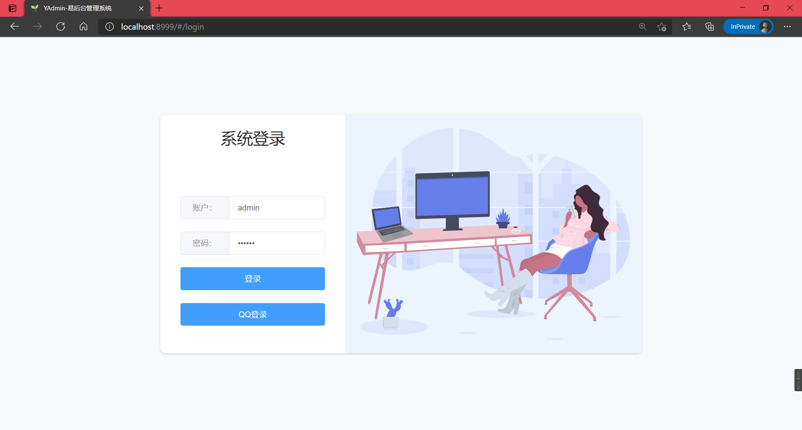
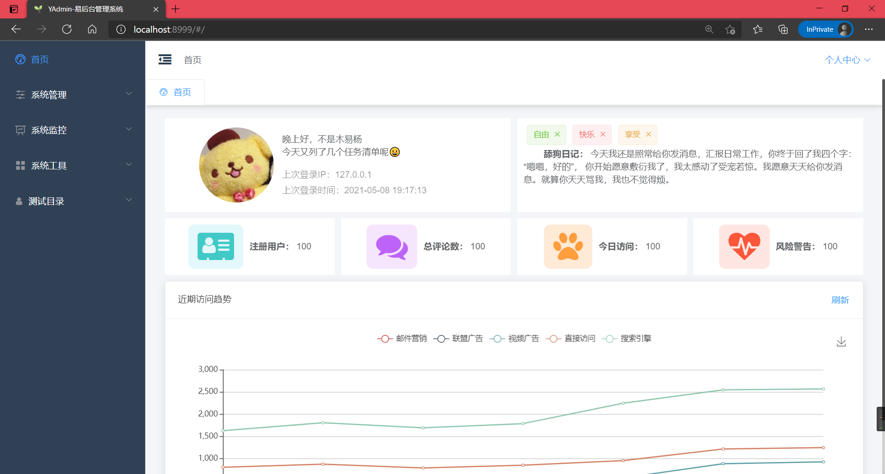
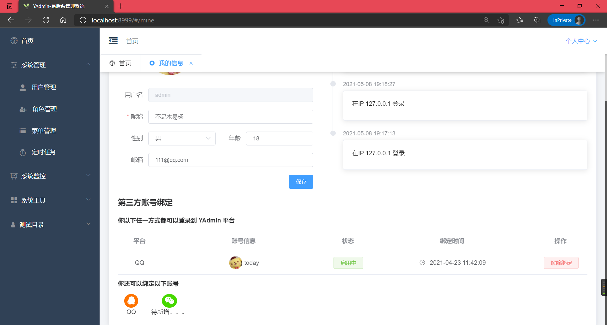
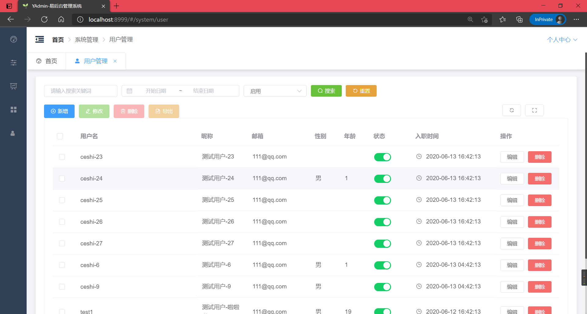
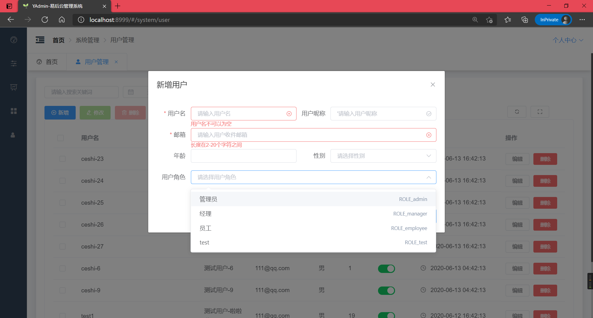
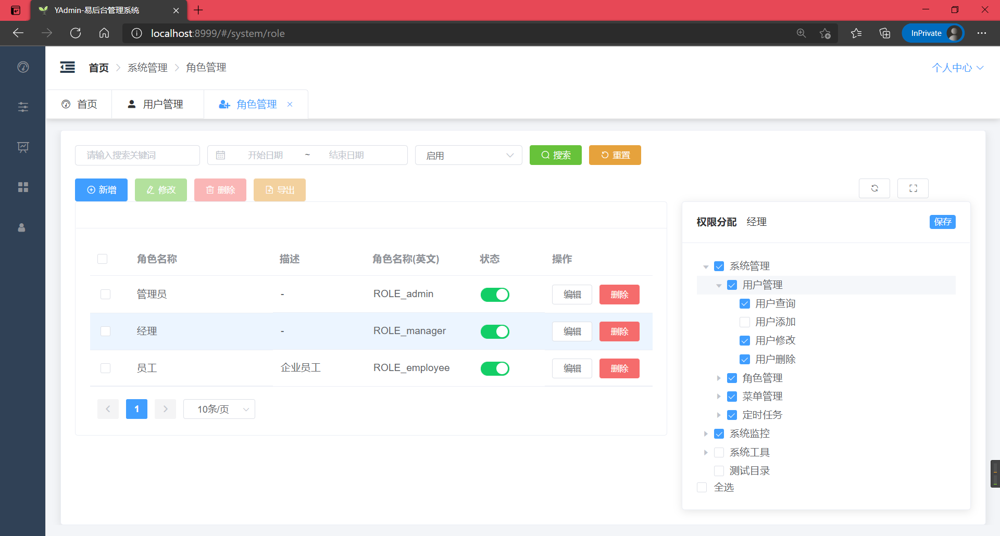
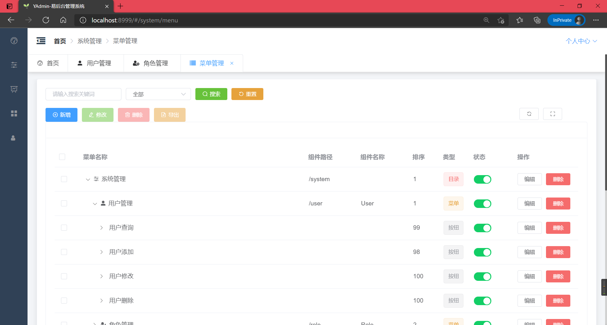
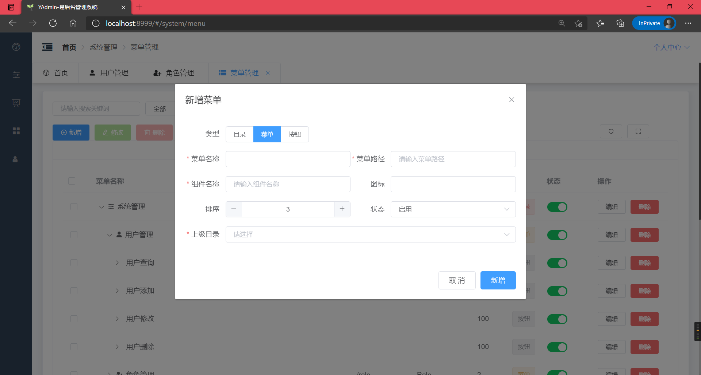
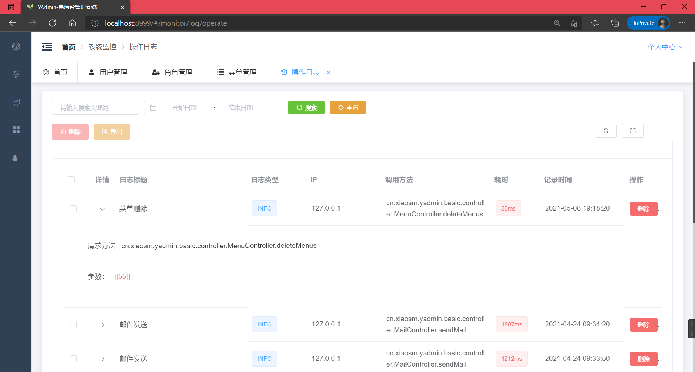
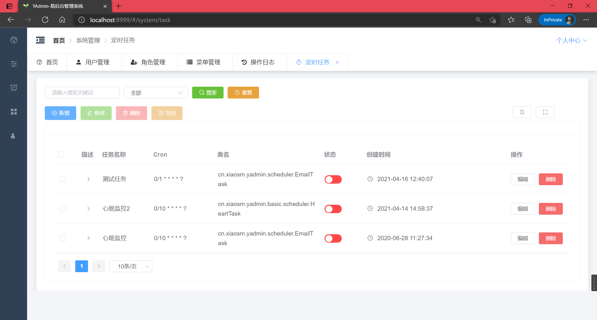
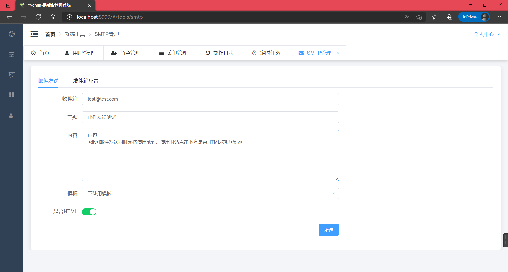

